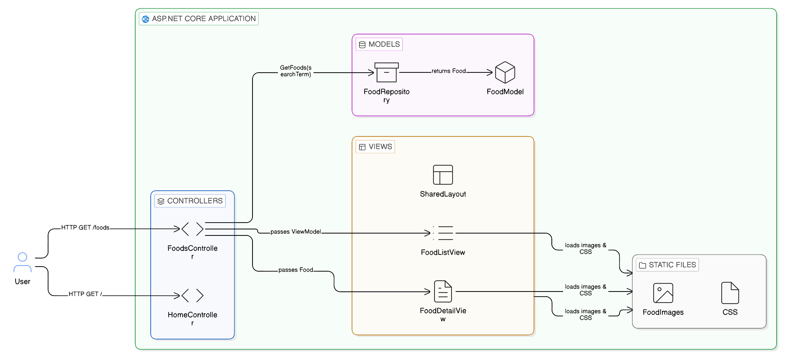
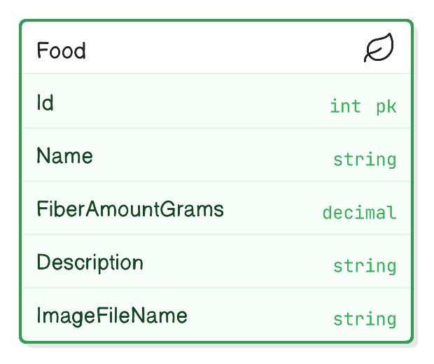
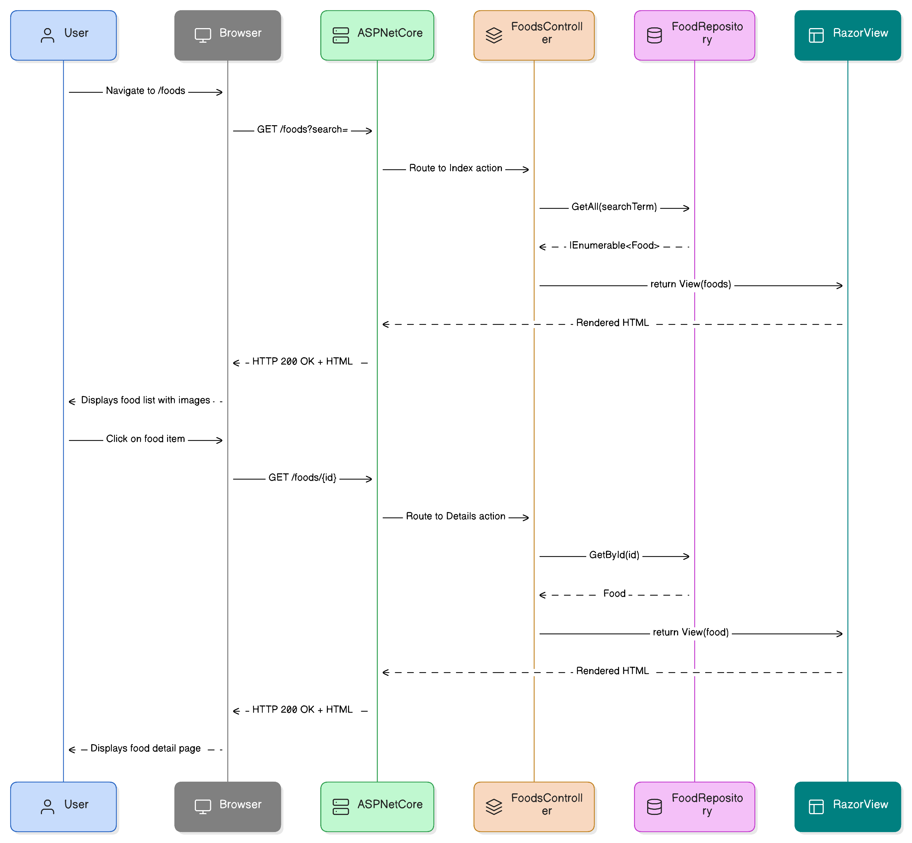
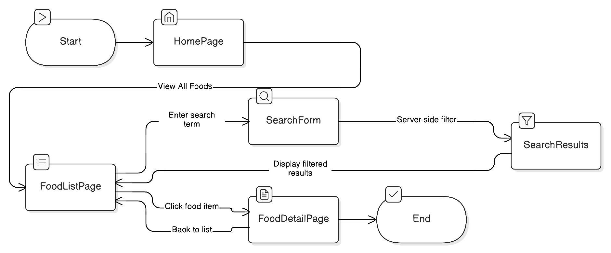

# Architecture — High Fiber Diet

## Overview

The **High Fiber Diet** application is a simple, server-rendered ASP.NET Core MVC web application. It presents a curated collection of high-fiber foods with images, fiber amounts, and descriptions. All rendering happens on the server; there is no client-side JavaScript.

---

## Technology Stack

| Layer       | Technology                          |
|-------------|-------------------------------------|
| Runtime     | .NET Core (latest LTS)              |
| Framework   | ASP.NET Core MVC                    |
| Views       | Razor (`.cshtml`)                   |
| Styling     | Plain CSS (`wwwroot/css/site.css`)  |
| Data Store  | In-memory collection (seed data)    |
| Static Files| `wwwroot/images/foods/` (PNG / JPG) |

---

## Application Architecture

The diagram below shows the high-level components of the application and how they interact.



### Components

| Component         | Responsibility                                                              |
|-------------------|-----------------------------------------------------------------------------|
| `HomeController`  | Renders the landing / home page.                                            |
| `FoodsController` | Handles food list (with optional search) and food detail page requests.     |
| `FoodRepository`  | Provides access to the seeded food collection; supports search by name.     |
| `Food` (Model)    | Strongly-typed data class for a food item.                                  |
| Razor Views       | Server-side HTML templates for list, detail, and shared layout pages.       |
| Static Files      | CSS stylesheet and food images served from `wwwroot/`.                      |

---

## Data Model

The application has a single entity — `Food`.



### Food Entity

| Property          | Type     | Required | Description                                     |
|-------------------|----------|----------|-------------------------------------------------|
| `Id`              | `int`    | Yes      | Unique identifier for the food item.            |
| `Name`            | `string` | Yes      | Display name (e.g., "Lentils").                 |
| `FiberAmountGrams`| `decimal`| Yes      | Grams of dietary fiber per 100 g of food.       |
| `Description`     | `string` | No       | Short nutritional or usage notes.               |
| `ImageFileName`   | `string` | Yes      | Filename of the food image in `wwwroot/images/foods/`. |

---

## Request Flow

The sequence diagram below shows the end-to-end flow for a typical page request.



### Food List Page (`GET /foods`)

1. The user navigates to `/foods` (optionally with `?search=<term>`).
2. ASP.NET Core routes the request to `FoodsController.Index(string? search)`.
3. The controller calls `FoodRepository.GetAll(search)` which returns a filtered (or full) list.
4. The controller passes the list to the `Foods/Index.cshtml` Razor view.
5. The view renders server-side HTML including food cards with thumbnail images and fiber amounts.
6. The response is returned to the browser.

### Food Detail Page (`GET /foods/{id}`)

1. The user clicks a food item on the list page.
2. ASP.NET Core routes to `FoodsController.Details(int id)`.
3. The controller calls `FoodRepository.GetById(id)`.
4. If found, the `Food` is passed to `Foods/Details.cshtml`; if not found, a 404 is returned.
5. The view renders the full food detail with a larger image and description.

---

## User Journey

The flowchart below illustrates the paths a user can take through the application.



---

## Project Structure

```
src/
└── HighFiberDiet/
    ├── Controllers/
    │   ├── HomeController.cs
    │   └── FoodsController.cs
    ├── Data/
    │   └── FoodRepository.cs
    ├── Models/
    │   └── Food.cs
    ├── Views/
    │   ├── Shared/
    │   │   └── _Layout.cshtml
    │   ├── Home/
    │   │   └── Index.cshtml
    │   └── Foods/
    │       ├── Index.cshtml
    │       └── Details.cshtml
    ├── wwwroot/
    │   ├── css/
    │   │   └── site.css
    │   └── images/
    │       └── foods/
    │           ├── lentils.jpg
    │           ├── chickpeas.jpg
    │           └── ...
    └── Program.cs
```

---

## Key Design Decisions

1. **No JavaScript** — All filtering, routing, and rendering is handled server-side. The search form uses `method="get"` so the search term appears in the URL and is bookmarkable.
2. **In-memory seed data** — No database server is needed. Food data is seeded in `FoodRepository` at startup, making the app self-contained and easy to run.
3. **MVC over Razor Pages** — The MVC pattern provides a clean separation between data (Repository), logic (Controllers), and presentation (Views).
4. **Static images** — Food images are bundled in `wwwroot/images/foods/` and served as static files, avoiding the need for a blob storage service.
5. **Fallback for missing images** — Views check whether `ImageFileName` resolves to an existing file and render a placeholder if not.
